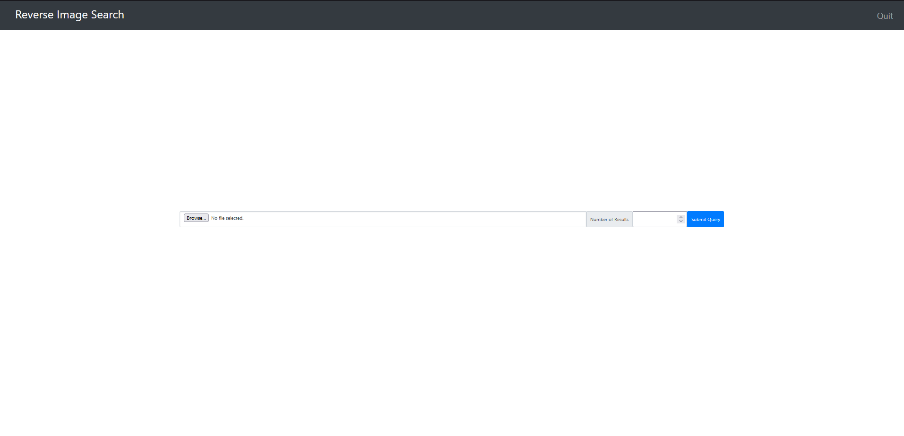
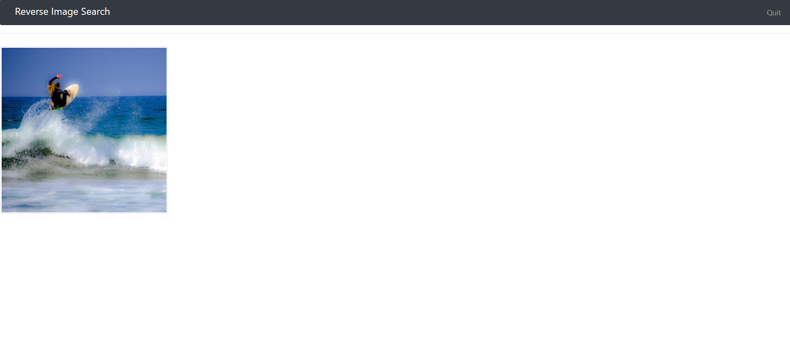

<!-- PROJECT LOGO -->
<br />
<p align="center">


  <h3 align="center">Reverse Image Search !</h3>

  <p align="center">
    A Deep Learning based image retrieval tool!
    <br />
   
</p>

 


<!-- TABLE OF CONTENTS -->
<details open="open">
  <summary>Table of Contents</summary>
  <ol>
   <li><a href="#about-the-project">About the Project</a></li>
    <li>
      <a href="#getting-started">Getting Started</a>
      <ul>
        <li><a href="#prerequisites">Prerequisites</a></li>
        <li><a href="#installation">Installation</a></li>
      </ul>
    </li>
    <li><a href="#usage">Usage</a></li>
    <li><a href="#contact">Contact</a></li>
  
  </ol>
</details>


<!-- ABOUT THE PROJECT -->
## About The Project


This is a ResNet50 based reverse image lookup tool , that can help you find similar images in a large database.
<br>
It used 2048 dimenional vector representation of images to compare two similar using cosine distance, It uses hdf5 for storing features.
<br>
It is implemented as a class that has two funtions that can be called :
<br>
* *generate_feature_embeddings* with arguments (database path , batch size) - This generates the 2048 dimensional vector representations and saves them in an hdf5 file
* *query with arguments number of results* , path of the picture being queried , path of databse. This returns a list of filenames in the database which are similar to the queried picture

It has been dockerised , and has flask support for deployment.


<!-- GETTING STARTED -->
## Getting Started

How to setup on your machine

### Prerequisites

It has been tested on Windows and Linux, although it can run on macOS with little or no modification.<br>
Tensorflow,keras has been omitted in the requirements.txt , user can opt for tensorflow-gpu(recomended) or tensorflow-cpu and pip install keras<br>
Docker-> if you want to run a simple image without the fuss or setting up everything.


### Installation
#### Docker
1. Clone the repo and Change directory
   ```sh
   git clone https://github.com/your_username_/Project-Name.git
   cd Reverse_Image_Search/
   ```
2. Build Docker Image
   ```sh
   docker build --tag <IMAGE-NAME-YOU-WANT> .
   ```
3. Run Docker Container
   ```sh
   docker run -it -e GENEMBED=<TRUE or FALSE> -v path/to/database:/usr/share/reverseimagesearch/database -v path/to/uploads_folder:/usr/share/reverseimagesearch/uploads -p <port you want to use>:7000 --name reverseimagesearch_container <IMAGE-NAME-YOU-WANT>
   ```
   An example would be<br>
   ```sh
   docker run -it -e GENEMBED=TRUE -v $(pwd)/database:/usr/share/reverseimagesearch/database -v $(pwd)/uploads:/usr/share/reverseimagesearch/uploads -p 5000:7000 --name reverseimagesearch_container reverseimagesearch_image
   ```
#### Direct API
 1. Clone the repo and Change directory
   ```sh
   git clone https://github.com/your_username_/Project-Name.git
   cd Reverse_Image_Search/
   ```
2. install required python packages (install tensorflow gpu if you want fast performance)
   ```sh
   pip install -r requirements.txt
   pip install tensorflow-cpu 
   pip install keras
   ```
3. Run model_api_class.py to test api functionality
   ```sh
   python3 model_api_class.py <path to database> <path to query picture>
   ```
   An example would be<br>
   ```sh
    python3 model_api_class.py ./database ./query_pic.jpg
   ``` 

<!-- USAGE EXAMPLES -->
## Important !!

Currently there is no error handling in the file io as in<br>
if the database has a non image type , then the program will simply break

Your system may need some dependencies for opencv to work, look up how to setup opencv for your machine


<!-- CONTACT -->
## Contact

Bazif Rasool - [@BazifRasool](https://twitter.com/@BazifRasool) - baziflaherwal@gmail.com


